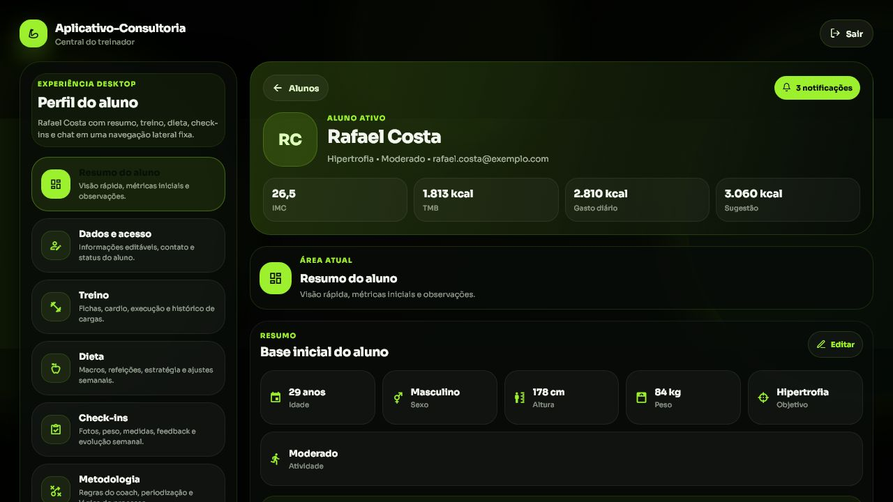
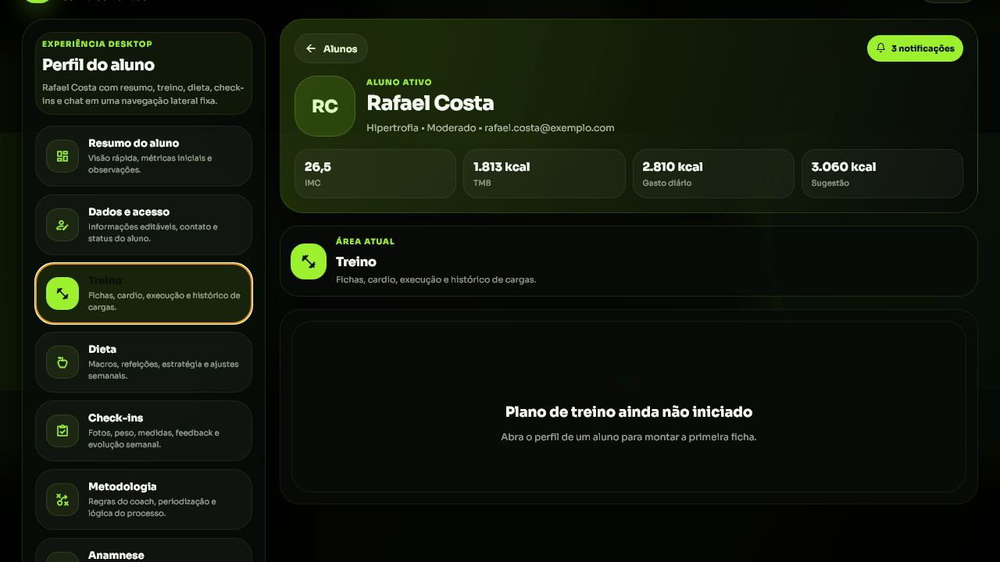
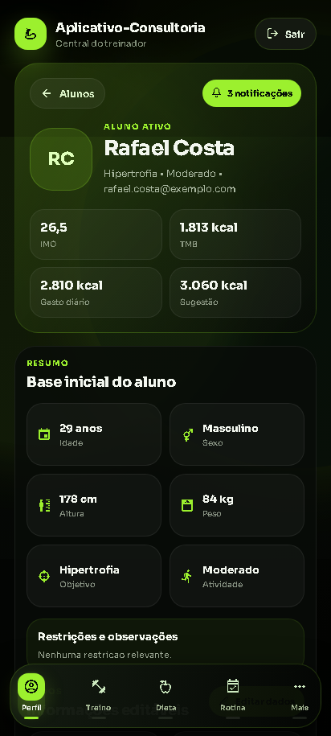
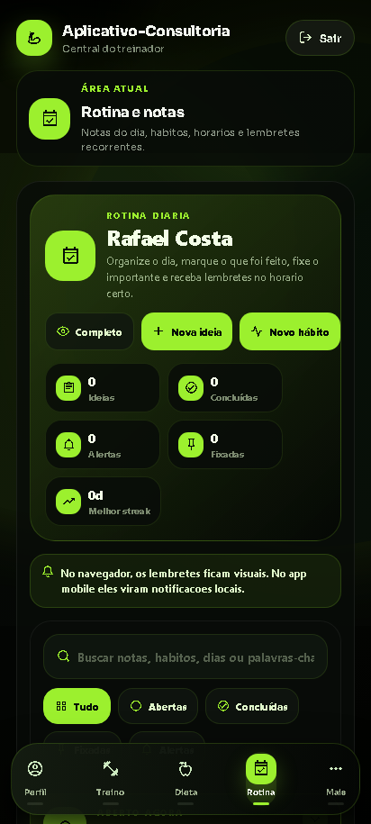

<p align="center">
  
</p>

<h1 align="center">Aplicativo Consultoria</h1>

<p align="center">
  Uma experiência premium para consultorias fitness, com visual marcante, navegação fluida e tudo o que treinador e aluno precisam no mesmo lugar.
</p>

<p align="center">
  
  
  
  
  
</p>

## O que ele entrega

O projeto foi pensado para apresentar a consultoria de forma forte e organizada, com foco em experiência visual e uso diário.

- **Para o treinador**: painel com alunos, treino, dieta, check-ins, chat e evolução.
- **Para o aluno**: acesso claro ao que importa no dia a dia, sem poluição visual.
- **Para a marca**: uma presença digital com identidade forte e sensação de produto pronto.

## Destaques

- Visual escuro com acento neon e estética de produto premium.
- Home com entrada por perfil.
- Dashboard com experiência de consultoria em camadas.
- Modo demo para apresentar o projeto sem depender de dados reais.
- Página de download para o APK no web.
- Fluxo preparado para mobile, web e preview.

## Galeria

<table>
  <tr>
    <td align="center">
      
      <br />
      <sub>Dashboard demo no desktop</sub>
    </td>
    <td align="center">
      
      <br />
      <sub>Área de treino no desktop</sub>
    </td>
  </tr>
  <tr>
    <td align="center">
      
      <br />
      <sub>Home no mobile</sub>
    </td>
    <td align="center">
      
      <br />
      <sub>Rotina no mobile</sub>
    </td>
  </tr>
</table>

## Experiência

- **Treino** com visão clara de fichas, execução e acompanhamento.
- **Dieta** com organização pensada para rotina real.
- **Check-ins** para manter evolução visível.
- **Chat** para aproximação entre treinador e aluno.
- **Anamnese** para registrar contexto e direcionar o atendimento.

## Começando

Se você quiser rodar o projeto localmente:

```bash
npm install
npm run start
```

Para abrir no navegador:

```bash
npm run web
```

## O que precisa estar configurado

- Variáveis `EXPO_PUBLIC_SUPABASE_URL` e `EXPO_PUBLIC_SUPABASE_PUBLISHABLE_KEY` no ambiente.
- `EXPO_PUBLIC_SUPABASE_ANON_KEY` como fallback, se você quiser manter compatibilidade com configurações antigas.
- Estrutura do Supabase aplicada a partir da pasta `supabase/`.
- Link do APK em `EXPO_PUBLIC_APK_DOWNLOAD_URL` se você quiser habilitar a página de download.

## Links rápidos

- **Demo de treinador na web:** `/?demo=trainer`
- **Página de download:** `/?page=download`

## Estrutura visual do projeto

```txt
App-Consultoria/
├── assets/
│   └── readme/
├── src/
├── supabase/
├── App.tsx
├── index.ts
└── app.json
```

## Observação

Esse README foi montado para funcionar mais como apresentação do produto do que como documentação técnica pesada. A ideia é que ele passe valor rapidamente para quem cai no repositório pela primeira vez.
